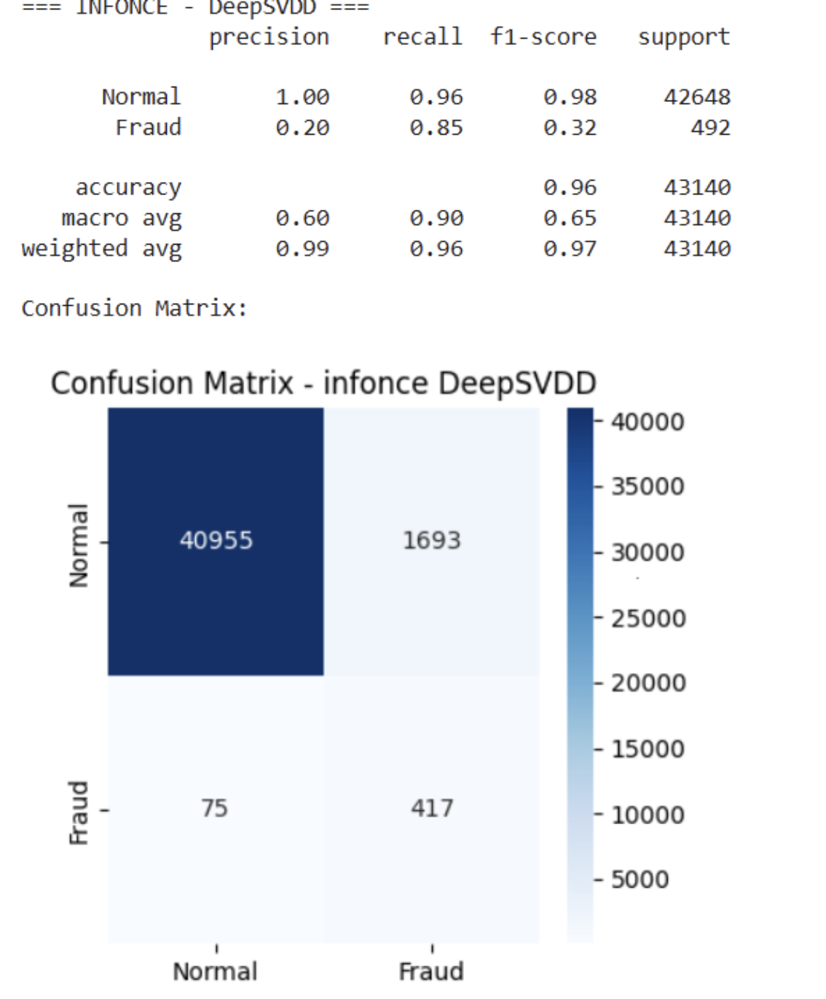
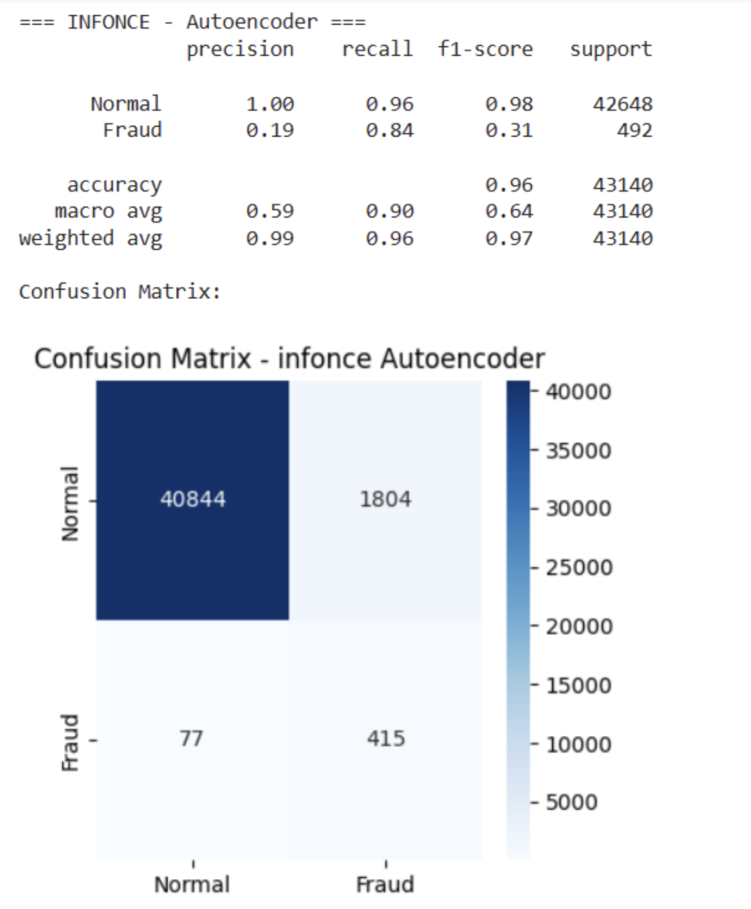

# 🛡️ Self-Supervised Credit Card Fraud Detection  
**SCARF + Deep SVDD + Autoencoder + Isolation Forest**  

---

## 🔍 Project Overview  
This project implements an **end-to-end fraud detection pipeline** for highly imbalanced credit card transaction data. Instead of relying solely on labels, the system uses **Self-Supervised Contrastive Learning (SCARF)** to learn robust tabular embeddings and applies multiple anomaly detection methods downstream.  

The design mimics an **industry-style fraud detection workflow**, with:  
- **Time-aware data splitting** to avoid leakage.  
- Multiple **self-supervised loss functions** (InfoNCE, Barlow Twins, VICReg).  
- **Anomaly detection backends** (Deep SVDD, Autoencoder, Isolation Forest).  
- A **Streamlit dashboard** for interactive testing.  
- MLOps-style artifact storage for deployment readiness.  

---

## 📂 Dataset  
- **Source:** [Kaggle – Credit Card Fraud Detection](https://www.kaggle.com/mlg-ulb/creditcardfraud)  
- **Size:** 284,807 transactions  
- **Features:**  
  - `Time`  
  - `Amount`  
  - `V1–V28` (PCA components)  
  - `Class` → {0 = normal, 1 = fraud}  
- **Fraud prevalence:** 0.1727% (492 fraud cases)  

### Splitting Strategy (time-aware)  
- **Train_normal:** Earliest 70% of normal transactions  
- **Val_normal:** Next 15% of normal transactions (for threshold & hyperparameter tuning)  
- **Test_mixed:** Latest 15% of normal transactions + all fraud cases  

### Scaling  
- Standardized `Time` and `Amount` **using Train_normal statistics only** to prevent leakage.  

---

## 🏗️ Methodology – End-to-End Pipeline  

The pipeline was designed to mirror an **industry-style fraud detection workflow**, from raw data through to deployment.  

### **1. Data Preparation**  
- Kaggle dataset with 284,807 transactions and only 0.17% fraud.  
- Chronological splitting (train/val/test) to simulate real-time deployment.  
- Scaling applied only on training statistics to prevent leakage.  

---

### **2. Self-Supervised Pretraining (SCARF)**  
- **Goal:** Learn tabular embeddings without fraud labels.  
- **Backbone:** MLP encoder with projection head.  
- **Augmentations:** Feature dropout + masked learning.  
- **Loss functions (trained separately):**  
  - InfoNCE (Contrastive Loss)  
  - Barlow Twins  
  - VICReg  

👉 Produced three embedding sets for downstream anomaly detection.  

---

### **3. Downstream Anomaly Detection Models**  
- **Deep SVDD** → hypersphere boundary around normal embeddings.  
- **Autoencoder** → reconstruction error signals anomalies.  
- **Isolation Forest** → tree-based anomaly isolation.  

👉 Thresholds tuned only on Val_normal set (no fraud labels).  

---

### **4. Evaluation Strategy**  
- **Test set:** Latest normal transactions + all frauds.  
- **Metrics:** ROC-AUC, Recall (fraud class), Confusion Matrices.  
- Results: ROC-AUC = 0.92–0.95 range; Recall = 0.83–0.87.  
- Confirms SCARF embeddings provide strong fraud separability.  

---

### **5. Deployment (Streamlit App)**  
- Streamlit dashboard for interactive testing:  
  - Upload/select dataset  
  - Run predictions with trained models  
  - Display confusion matrices + metrics  
- Built in **Google Colab**, extendable to Streamlit Cloud/Docker.  

---

### **6. MLOps Readiness**  
- Artifacts (models, embeddings, thresholds) stored in Google Drive.  
- Training tracked via MLflow logs.  
- Repo structure extendable to MLflow/DVC for full production monitoring.  

---

## 📊 Results  

The models were evaluated on the **Test_mixed** set (latest normal + all frauds).  

### ROC-AUC & Recall Performance  

| SCARF Loss   | Model            | ROC-AUC | Recall (Fraud) |  
|--------------|-----------------|---------|----------------|  
| **InfoNCE**  | Deep SVDD        | 0.937   | 0.85           |  
|              | Autoencoder      | 0.949   | 0.84           |  
|              | Isolation Forest | 0.940   | 0.86           |  
| **Barlow**   | Deep SVDD        | 0.924   | 0.83           |  
|              | Autoencoder      | 0.939   | 0.85           |  
|              | Isolation Forest | 0.932   | 0.86           |  
| **VICReg**   | Deep SVDD        | 0.924   | 0.84           |  
|              | Autoencoder      | 0.949   | 0.85           |  
|              | Isolation Forest | 0.939   | 0.87           |  

---

### 📌 Key Observation  
In fraud detection, **Recall is the most critical metric** because missing a fraud (false negative) is more costly than flagging a normal transaction (false positive). Across all SCARF losses and detectors, recall remained in the **0.83–0.87 range**, showing the system effectively captured rare fraud cases.  

---

### Confusion Matrices (Examples)  

Representative results:  

- **InfoNCE - Deep SVDD**


- **InfoNCE - Autoencoder**  

 

👉 *Full confusion matrices for all experiments are available in the `screenshots/` folder.*  

---

## 🎛️ Streamlit App  
An interactive fraud detection dashboard built with **Streamlit**:  
- Upload/select test data  
- Run predictions across detectors  
- Visualize confusion matrices & metrics  
- Runs in **Google Colab**, portable to Streamlit Cloud/Docker  

---

## 🚀 Reproducibility & Setup  

### Run in Google Colab  
1. Clone repo:  
   ```bash
   !git clone https://github.com/Dhakshash/CreditCardFraud-SSL
   cd CreditCardFraud-SSL
Mount Google Drive (for artifacts):

from google.colab import drive
drive.mount('/content/drive')

Open and run:
SCRAF_Credit_Fraud.ipynb → train SCARF embeddings + anomaly models
Streamlit_App_Credit_Fraud.ipynb → launch interactive dashboard

---

## 📂 Repository Structure

- **ipynb_files/** -              # SCARF pretraining + anomaly detection and Streamlit dashboard
- **dataset/** -                               # Credit card fraud dataset (or link)
- **screenshots/** -                           # Confusion matrices, plots, app UI
  -  **app_screenshots/** -          #Screen shots of Credit Card Fraud Detection app
- **README.md** -                              # Documentation

---

## ⚠️ Limitations
Dataset is PCA-transformed, lacking raw metadata (limits explainability).

Fraud prevalence is extremely low (0.17%), making recall challenging.

Thresholds are dataset-dependent and must be tuned per deployment.

Current version is a proof-of-concept demo, not production-grade.

---

## 🔮 Future Work
Integrate raw features + metadata for richer models.

Add explainability tools (SHAP, LIME) for predictions.

Validate on larger, real-world datasets.

Explore additional self-supervised objectives such as Triplet Loss for embedding training.

Deploy via Streamlit Cloud or Docker with MLflow monitoring.

---

## 🤝 Connect
For questions, collaborations, or opportunities related to AI in finance and risk modeling, feel free to connect through dhakshashganesan@gmail.com or GitHub.
